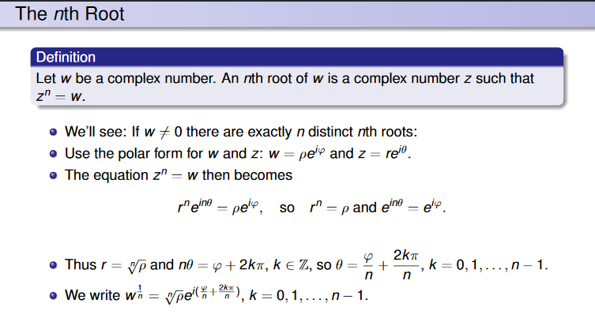
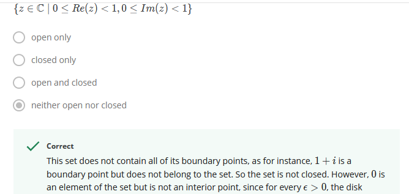

## Introduction to Complex Analysis

by Wesleyan University

## Week-01

Bombelli’s Problem: `x^3=15x+4`

The principal argument of `z` called `Arg z`, is the value of `theta` for which `-Pi<theta<=Pi`

`arz z={Arg z+2Pik : k in Z}`

`arg(z*)= -arg(z) = arg(1/z)`

the disk Bϵ​(0) is not entirely contained in the set. Therefore, the set is not open either. Hence it is neither open nor closed.

## complex plane with the origin removed

For z∈C∖{0}, let ϵ=∣z∣/2> 0, then the disk Bϵ(z) is entirely contained in C∖{0}. So C∖{0} is open. It is not closed however, since 0 is not in the set but is a boundary point. So it is open only.

## Week-02

It thus suffices to study the iteration of quadratic polynomials of the form `f(z)=z^2+c`

The Julia set of `f(z)=z^2+c` is the set of all `z` for which the behavior of the iterates is chaotic in a neighborhood.

The Fatou set is the set of all `z` for which the iterates behave normally in a neighborhood.
